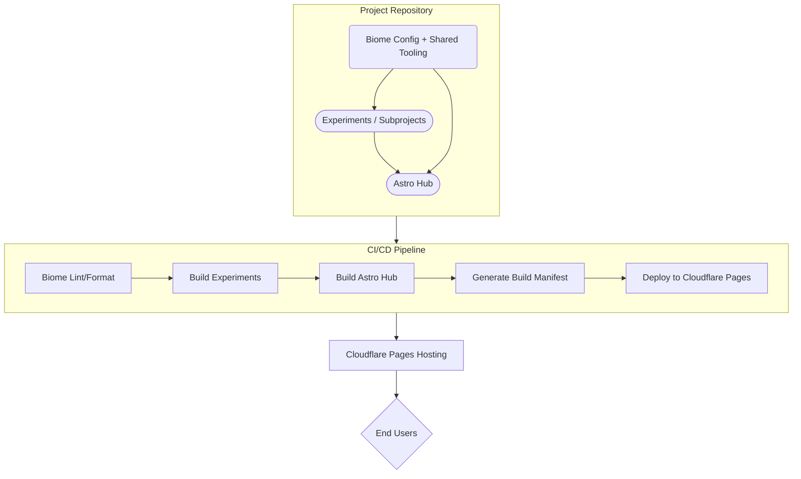

# deu.tz labs

**Labs is a repository dedicated to exploration, prototyping, and documenting experiments. It serves as a safe environment to validate ideas before they evolve into production-ready projects. Each entry in Labs is both an archive and a stepping stone.**

## Experiment Index

### P5js & toxiclibs based physics simulation

#### Features

- UI for physics settings
- Mouse interactable

#### Disclaimers

- Barely responsive
- Some physics settings break the sim which requires a page reload

----

## Repo structure and deploy workflow

